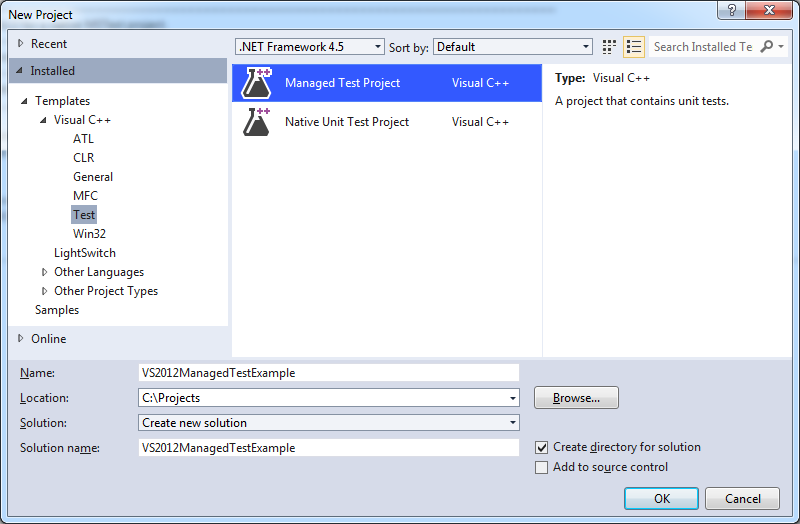
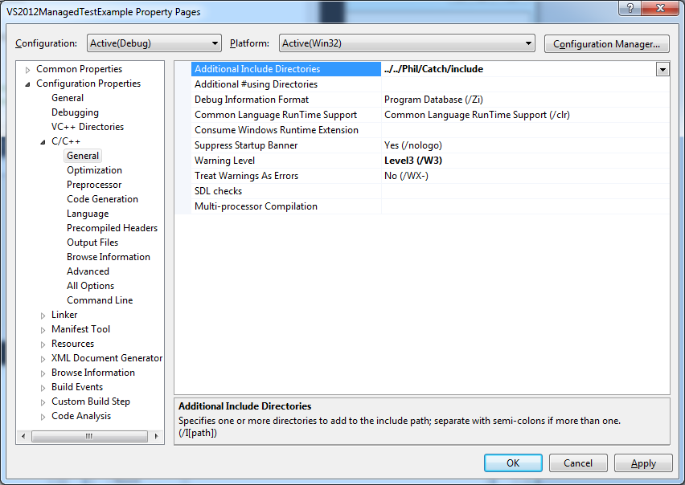
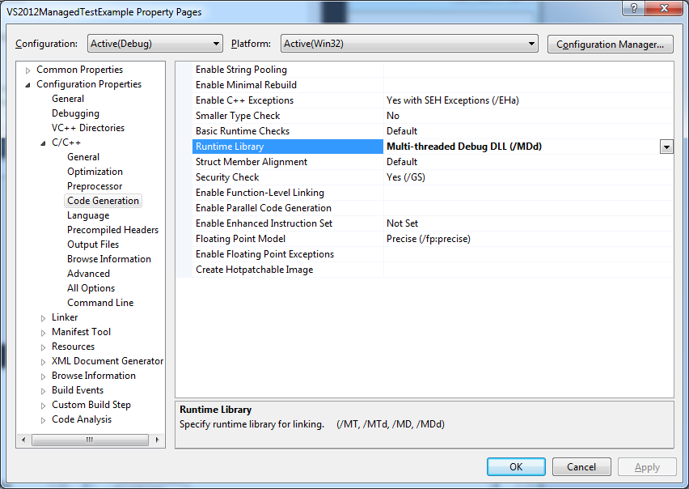
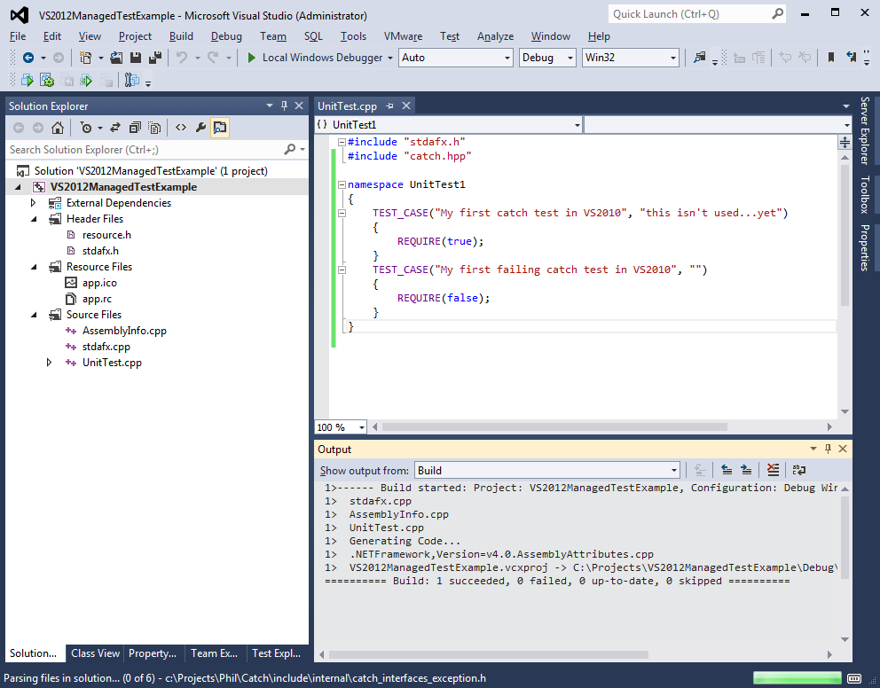
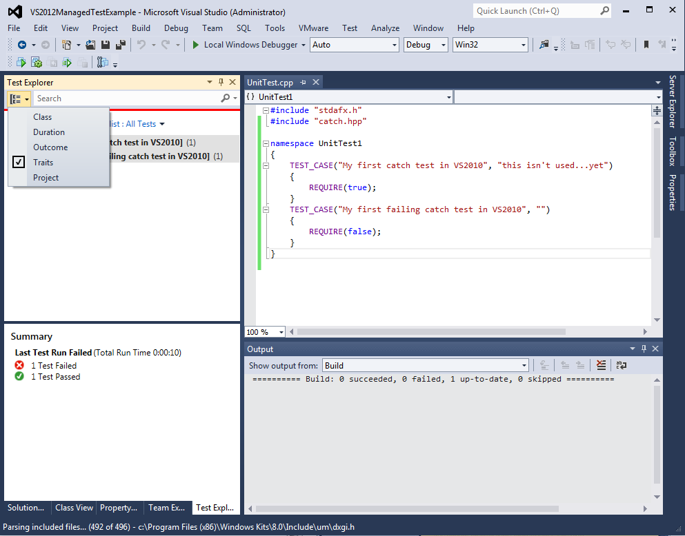
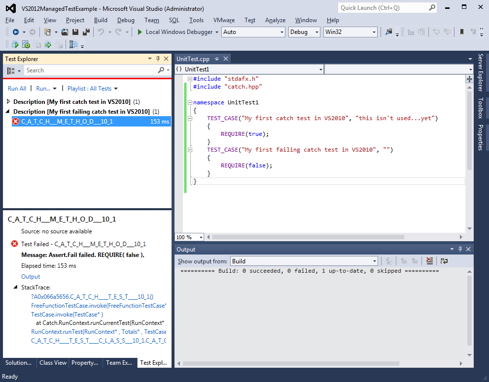
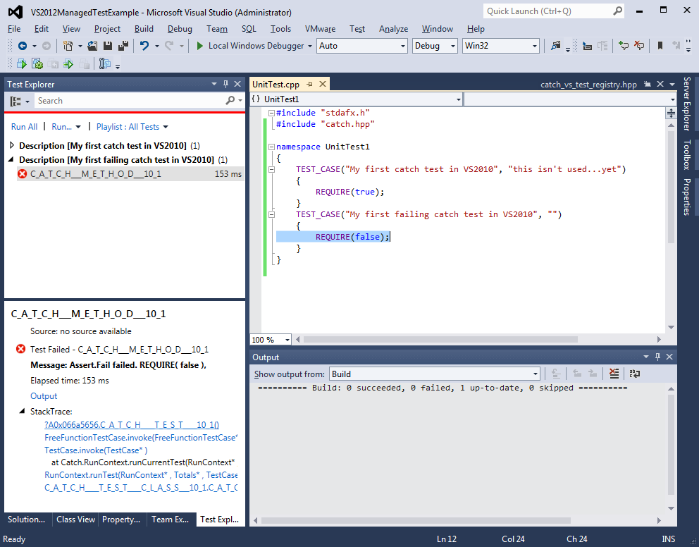

Creating managed tests in VS2012 is very similar to creating tests in VS2010.

[pre-requisite - obviously, you'll also need Catch - my copy is in C:\Projects\Phil\Catch in the following examples...and I'm using the normal, multiple include files.]

## First, start by creating a new project

Choose 'File' ==> 'New' ==> 'Project' and choose a new Visual C++ Managed Test project:


Now we need to change some build options, so right click the project and choose 'Properties':

First, in the 'General' options, change 'Common Language Runtime Support' to use basic clr:


By default, Unicode will have been enabled - it is up to you whether to use Unicode or not - Catch will work with either setting.

Next, add Catch to the 'includes':



...and change the debug runtime to be a Debug DLL:



## Now write a test

Next, delete the test code that the wizard provided in UnitTest.cpp and write your own...




We can run this from the 'Test Explorer' but be sure to select the 'Traits' option from the drop down if you want to see the Catch TEST_CASE names:




Sadly, VS2012 is not as intuitive as VS2010; from here you have top open up the failing test to get the failure information:



You can click the 'Output' link to see the output text:


Now if you click the link at the top of the stack trace "...unittest.cpp: line 12" you get back to the problem:



And that's it!

## Creating a Catch console project

If you want to run Catch normally from the console, just create a new Windows Console app (you will need to turn off Unicode for this!) and add an additional .cpp file for `'main()'`.  I usually add a file called main.cpp, like this:

```
#define CATCH_CONFIG_MAIN
#include "catch.hpp"
``` 

---

[Home](../../README.md)